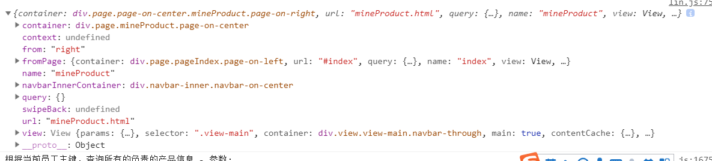

最近用到了framework7的框架来开发移动端。并不是最新的版本，用的是1.65版本。  
framework7不需要任何第三方的库，包括DOM操作。她有自己的 DOM7 - 一个集成了大部分常用DOM操作的高性能库。你不需要学习任何新的东西，因为它的用法和大名鼎鼎的jQuery几乎是一样的，包括大部分常用的方法和jquery风格的链式调用。本文会简单的介绍一下它的HTML基本结构，布局，初始化应用，视图，页面回调等。→[官网传送门](http://framework7.taobao.org/docs/app-layout.html#initialize-app)  
# HTML结构  
首先创建一个'index.html',再来看下官方给你html结构。  
```
<!DOCTYPE html>
<html>
  <head>
    <!-- Required meta tags-->
    <meta charset="utf-8">
    <meta name="viewport" content="width=device-width, initial-scale=1, maximum-scale=1, minimum-scale=1, user-scalable=no, minimal-ui">
    <meta name="apple-mobile-web-app-capable" content="yes">
    <meta name="apple-mobile-web-app-status-bar-style" content="black">
    <!-- Your app title -->
    <title>My App</title>
    <!-- Path to Framework7 Library CSS, iOS Theme -->
    <link rel="stylesheet" href="path/to/framework7.ios.min.css">
    <!-- Path to Framework7 color related styles, iOS Theme -->
    <link rel="stylesheet" href="path/to/framework7.ios.colors.min.css">
    <!-- Path to your custom app styles-->
    <link rel="stylesheet" href="path/to/my-app.css">
  </head>
  <body>
    <!-- Views -->
    <div class="views">
      <!-- Your main view, should have "view-main" class -->
      <div class="view view-main">
        <!-- Top Navbar-->
        <div class="navbar">
          <div class="navbar-inner">
            <!-- We need cool sliding animation on title element, so we have additional "sliding" class -->
            <div class="center sliding">Awesome App</div>
          </div>
        </div>
        <!-- Pages container, because we use fixed-through navbar and toolbar, it has additional appropriate classes-->
        <div class="pages navbar-through toolbar-through">
          <!-- Page, "data-page" contains page name -->
          <div data-page="index" class="page">
            <!-- Scrollable page content -->
            <div class="page-content">
                <!-- todo -->
            </div>
          </div>
        </div>
        <!-- Bottom Toolbar-->
        <div class="toolbar">
          <div class="toolbar-inner">

          </div>
        </div>
      </div>
    </div>
    <!-- Path to Framework7 Library JS-->
    <script type="text/javascript" src="path/to/framework7.min.js"></script>
    <!-- Path to your app js-->
    <script type="text/javascript" src="path/to/my-app.js"></script>
  </body>
</html> 
```  
分析一下，上面的结构`<head></head>`中，已经告诉我们了哪些文件是必须的了，除了引入的"my-app.css"这个文件，这个文件是你自己的页面样式文件。  
再看`<body></body>`中的结构，当中有个唯一个类名"views",我理解就是一个始祖盒子，从这个始祖盒子往下一层一层找，会发现一个`<div data-page="index" class="page"></div>`这个div盒子标签，到了这里你会发现里面就分为两层了。一个是顶部导航，还有一个就是page-content（页面内容）。当然是可以滑动的页面内容了，但是需要另加一个内名，这个在framework7里API里有。最后我们看下"<body>"底部的`<script></script>`标签，除了引入framework7的必须的js外，还有一个就是my-app.js这个文件，这里面就是你当前项目需要的js逻辑代码。  
# 布局  
Framework7 完全支持从右向左的语言。你只需要增加一个额外的CSS文件即可：  
```
<!DOCTYPE html>
<html>
  <head>
    ...
    <title>My App</title>
    <!-- Path to Framework7 Library CSS-->
    <link rel="stylesheet" href="path/to/framework7.[theme].min.css">
    
    <!-- Enable RTL by including additional RTL styles: -->
    <link rel="stylesheet" href="path/to/framework7.[theme].rtl.min.css">
    
    <!-- Path to your custom app styles-->
    <link rel="stylesheet" href="path/to/my-app.css">
    ...
```  
这个在你跳转页面的时候，使用浏览器工具查看ELEMENT的话，你会发现，你只要跳转到下一个页面，下个页面是从屏幕右边来的还会把当前的页面给覆盖掉，并不是删除，但是如果你有返回按钮返回上个页面的话，上个页面是从左边来，可是注意浏览器工具中的ELEMENT，当前的页面会被销毁。  
# 初始化应用  
你已经有了基本的页面布局和需要用的CSS以及JS文件。现在我们需要初始化我们的应用，以上面的结构为例，初始化的js代码可以写在"my-app.js"里面。
```
var myApp = new Framework7();
```  
上面的代码是我们使用myApp作为变量名存储 Framework7 初始化之后的实例。"()"中传个对象，对象中可以参照官方的API来设置你自己需要的个性化定制。  
# 视图  
View (`<div class="view">`) - 在应用中是一个独立的部分，她有自己的设置、页面切换和历史。每一个视图都可以有不同的导航栏、工具栏布局和不同的样式。所以View就像是嵌在应用中的另一个应用。这种功能可以让你来分别操作一个应用中的不同部分。  
Views (`<div class="views">`) - 是所有可见View的容器（不包括Modal和Panel）。Views 是你的应用主容器。一个应用中只能有一个 Views  
# 页面  
Pages - 和你在网页中打开的页面是同样的意思.
在 main layout(index.html) 中，每一个 Page 都应该放在 Pages 容器中(`<div class="pages">`)，而 Pages 必须是 View 的子元素(`<div class="view">`)。  
你会发现每一个 page 都有一个 data-page 属性，存储了一个唯一的page名。这个属性不是必须的，但是强烈推荐使用。

这个属性在 page 事件中或者在page 回调函数中会非常有用，可以用来帮助我们确定加载的是哪一个页面。下面的页面回调会用到。  
# 页面回调  
Page 回调函数可以用来为特定的页面执行特定的代码.使用 Page 回调函数我们必须使用正确的App方法.比较常用的几个包括:PageBeforeInit，PageInit,onPageReinit,PageBeforeAnimation,PageAfterAnimation等等。
```
myApp.onPageAfterAnimation('index', function(page) {
    <!-- todo -->
});	
```  
上面的代码是当一个页面(有 data-page 属性)动画完成之后会触发，之后就是成功的回调，page这个参数就是代码当前页面的一些所有数据。我打印了一下"page"，如下图  
  
上图中，我现在比较常用的是container，from，fromPage，url，name这些属性。  
* container  
这个属性代表的是你当前页面的div盒子，注意下它的值`div.page.minProduct...`这些值就是代表上面html基本机构中`<div data-page="xxxxx"></div>`这个标签。其中后面跟的minProduct就是你标签中data-page后面的值。
* from
这个属性是告诉开发者，你当前的页面是从右边还是左边来的，在前面的布局中我们提到了它是一个从右向左的语言。它的值一般就两个'right'和'left'。right一般就是跳到新页面，left一般就是回到上个页面。  
* fromPage  
这个属性的话是告诉你当前页面是从哪个页面过来的，它是一个对象，这个对象包含了跳转前页面的基本信息，比如前个页面的container，name这一类的都有。  
* url  
这个从字面也是就知道了，是跳转的路由，就是你要调到哪个页面，这个就是当前的文件。  
* name  
这个属性就是来代表你当前页面的关键字的，上图中name的值'minProduct',这个是跟标签`<div data-page="xxxx"></div>`中data-page的值是一样的。  
  
    
## 总结  
上面所述的东西，个人认为可以让你有个大概的了解，这样你如果接到一个使用framework7框架写的项目的话，可以能更快的看懂它的API和基本的使用。