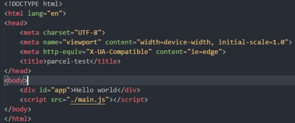
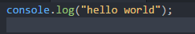
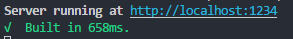
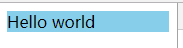
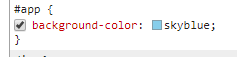
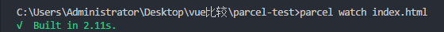

# parcel学习  

### 1、介绍  
[parcel官网](https://parceljs.org/)  
[GitHuB](https://github.com/parcel-bundler/parcel)  

Parcel 是一个Web应用程序 打包器(bundler) ，与以往的 开发人员使用的打包器有所不同。它利用多核处理提供极快的性能，并且你不需要进行任何配置。  
Parcel 可以将任何类型的文件作为 入口点(entry point) ，官网告诉我们 HTML 或 JavaScript 文件是一个很好的开始。  
  
### 2、用法  
* __安装__  
首先使用 Yarn 或 npm 安装 Parcel，这里我用的npm来全局安装的。  
   ```
   npm install -g parcel-bundler
   ```    
* __创建一个简单的项目__  
项目目录中创建一个 package.json 文件。  
`npm init -y`  
创建一个 index.html 和 main.js 文件。  
在index.htlm中引入main.js,使用相对路径将你的主 JavaScript 文件链接到 HTML 中，Parcel 也会为你处理，并将该引用替换为输出文件的 URL。  

  _index.html_
  
  
  _main.js_  
  

* __运行parcel打包__  
不需要做任何的配置，直接使用parcel命令指定入口文件即可。我这里按照官网指定index.html问入口文件  

    `parcel index.html`   
  
  执行完后，会出现一个地址.默认1234端口，后面是打包成功用过的时间。
    
  
  打开此地址，就能看见你的页面了。  
  
  
  如果你不想用它默认的1234端口，可以自己设置。可以使用 `-p <port number>` 选项覆盖默认端口。  
  _例如_：想使用8088端口，直接`parcel index.html -p 8088` 即可。  
  
  Parcel 内置了一个开发服务器，这会在你更改文件时自动重建你的应用程序，并支持 模块热替换 ，以便你快速开发。
  我在我的index.html文件中添加样式  
  ```
    <style>  
        #app {
            background-color: skyblue;
        }
    </style>
  ```
  随后，页面直接发生变化。   
    
    
  到现在为止，parcel没有做过任何的配置，只是安装了一下。  


### 3、模式  
parcel官网的文档中有生产环境一项，介绍了你使用parcel时用的那种模式，跟webpack中的development和production的区别差不多。parcel分了开发模式和生成模式两种，这两种模式还是有一些区别的。  
  
* __开发模式__  
    ```
    parcel <entry file>  
    ```  
    此模式下支持热更新，启动开发服务。代码并不会被压缩。  

* __生产模式__  
    ```
    parcel build <entry file>
    ```
    此模式将关闭监听模式和热模块替换,所以它只会编译一次。它还会开启 minifier 来减少输出包文件的大小,通俗来说就是只能打包一次的压缩过的文件。  
      
### 4、ParCel的CLI  
* __Commands__  
_服务（开发模式）_    
    ```  
    parcel ...
    ```  
    *_构建（生产模式）_  
    ```  
    parcel build ...  
    ```  
    *_监听_  
    此命令跟服务差不多，但是不会开启服务器。  
    ```
    parcel watch ...
    ```  
    这样说有点模糊，所以我试了一下`parcel watch index.html`。然后运行完后显示  
      。服务的运行后是这样  
      ，这样我们就发现区别在于Server running at "server URL"这句没有显示出来。按照语句的意思来看，一个是有运行，一个没运行。但是，热更新还有用吗？官网只说了不会开启服务，没说热更新不行。所以，`watch`过后我有修改了原文件index.html的文本节点`Hello world`后面加了几个！！！，发现dist文件夹下的打包过后的index.html也多了几个！！！。说明`watch`只是不会运行服务器，但是热更新还是开启的。  
        
    *_帮助_  
    尽可能的显示所有 cli 的选项  
    ```
    parcel help
    ```
* __Options__  
parcel说是无配置项，但是运行时后面还是可以跟一些配置项。这些配置可以满足一些用户的基本要求。  
  
  *_设置的输出目录_  
  parcel它默认为"dist"目录，若是感觉"dist"不好，像某些人用"target"来作为输出目录，就可以如下来配置，此项可用于serve，watch，build等命令。  
  ```
  parcel <entry file> --out-dir <root name>
  --或者--
  parcel <entry file> -d <root name>
  ```  
    *_设置要提供服务的公共 URL_  
    parcel默认的URL是："/"，这里使用官网的例子，可用于：serve，watch，build 。执行如下命令 
    ```
    parcel build entry.js --public-url ./dist/
    ```
    将输出到  
    ```
    <link rel="stylesheet" type="text/css" href="/dist/entry.1a2b3c.css">
    或者
    <script src="/dist/entry.e5f6g7.js"></script>
    ```  
    *_输出的文件名_  
    默认是输出的源文件名,可用于：serve，watch，build。执行命令如下  
    ```
    parcel build <entry file> --out-file <output file name>
    ```  

这些配置比较常用，还有其他的配置都是一样输入命令就行了，如果想了解更多可以去官网去看一下parcel的CLI栏。  
  
### 5、跟webpack的比较  
parcel的官网只介绍了parcel的用法，优点，和一些常见的功能。除了parcel的官网文档外，又上其他的社区和论坛，其中有一遍[文章](https://segmentfault.com/a/1190000012612891)写了它跟webpack的比较。想去看的可以点击进去看看，我只把其中说道的区别给搬运过来供大家参考。  
#### _pacel的心动点_  
* Parcel 能做到无配置完成一些简单项目构建要求;  
* Parcel 内置了常见场景的构建方案及其依赖，无需再安装各种依赖;  
* Parcel 能以 HTML 为入口，自动检测和打包依赖资源;  
* Parcel 默认支持模块热替换，真正的开箱即用;  
#### _Webpackc麻烦点_  
* 需要写一堆配置;  
* 需要再安装一堆依赖;  
* 不能简单的自动生成 HTML;   

但是文章中也不是一味的捧parcel，它也指出了parcel的一些缺点。parcel提倡无配置的话，就会牺牲一些东西比如放弃了灵活性(相比webpack)，比如：  
* 无法控制对部分文件的特殊处理，以实现诸如按需加载这样的需求;  
* 无法控制输出文件名的 Hash 值和名称;  
* 无法控制构建输出目录结构;  
等等...  

### 6、总结  
parcel的出现不算太早，所以也说明了它的体系不算太完善，还是有一些坑需要填的，但是很多人都认同他的便捷和快速，这也是一种发展的方向。在一些论坛和社区里有一些人提倡在个人的小项目或是小demo中可以使用来实践，毕竟填坑的方式就是实践来实现的。